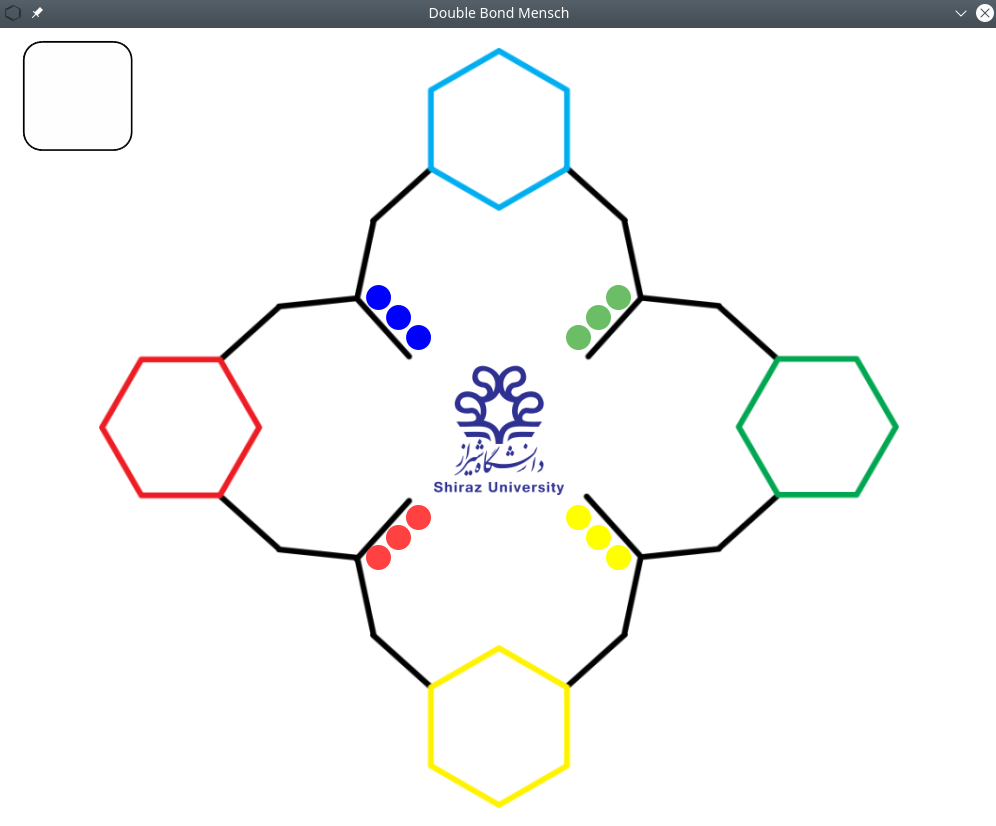

# Double Bond Mensch

### about

This game was developed for Faculty of Chemical Engineering at Shiraz University. It is a Mensch

-like game base on some chemical information. This game used for "Resonance Event 2021" hold on 30 march.

This is a initial game board:

### Tools

- Python 3
- Pygame

### Run The Game

For run the game on your computer you do as follow:

1. Install python 3 and pygmae on your computer.
2. Download the repository or clone it.
3. Go to the game directory and run `python3 main.py`